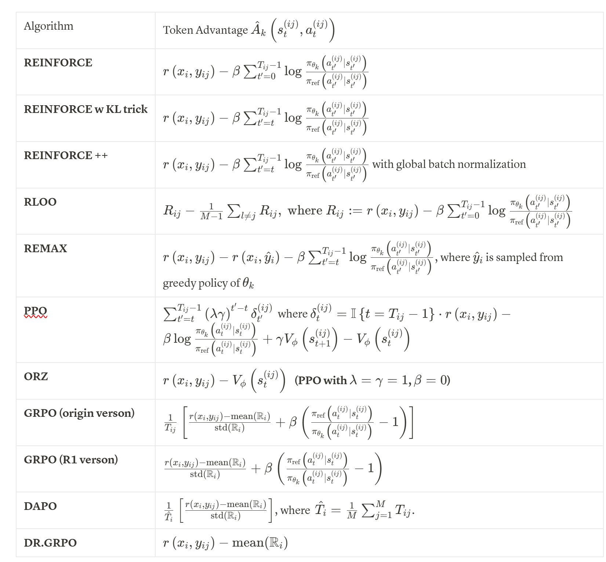

# RL4LLM笔记

跟着知乎学习一下当前RL是如何用于LLM的

**参考**
[https://zhuanlan.zhihu.com/p/1891822525274637445](https://zhuanlan.zhihu.com/p/1891822525274637445)

类比强化学习的概念，LLM的next-token prediction范式的policy $\pi(a|s)$ 即
$$\pi(\hat{y}| \hat{x}) = \prod_{t=0}^{T - 1} \pi(\hat{y}_t | (\hat{x}, \hat{y}_{<t}))$$
这里$\hat{x}$ 是文本前缀，$\hat{y}$ 是token序列.

我们希望求解的优化问题表示为,
$$\max_{\pi} \{ \mathcal{J}(\pi) := \mathbb{E}_{x \sim \mathcal{D}}\left[\mathbb{E}_{y \sim \pi_{x}} [r(x, y) - \beta \,\text{KL}(\pi_x, \pi_x^{ref})]\right]\}$$
这里$x$ 是prompt， $y$ 是输出的token序列，$\pi_{x}^{ref}$ 为参考策略，通常是原模型本身.

$\pi_{\theta}$是神经网络参数化的，求一下梯度
$$\nabla_{\theta} \mathcal{J}(\theta) = \mathbb{E}_{x \sim \mathcal{D}} \mathbb{E}_{y \sim \pi_{\theta}(\cdot | x)} \left[\left(
r(x, y) - \beta \log \frac{\pi_{\theta}(y|x)}{\pi_{ref}(y|x)}\right)\nabla_{\theta}\log\pi_{\theta}(y | x)\right] $$
注意到$y = (a_0, \dots, a_{T-1})$,  并定义$s_t := (x, a_0, \dots, a_{t-1})$, 带入就得到
$$\nabla_{\theta} \mathcal{J}(\theta) = \mathbb{E}_{x \sim \mathcal{D}} \mathbb{E}_{y \sim \pi_{\theta}(\cdot | x)} \left[

\sum_{t=0}^{T-1} \nabla_{\theta} \log{\pi_{\theta} (a_t | s_t)}
\left(
r(x, y) - \beta \sum_{t^{\prime} = 0}^{T - 1}\log \frac{\pi_{\theta}(a_{t^{\prime}}| s_{t^{\prime}})}{\pi_{ref}(a_{t^{\prime}}| s_{t^{\prime}})}
\right)

\right] $$
为了使BP能够成立(数据采样所用参数不能作为优化对象)，我们用以下替代函数作为损失函数，可以证明不改变梯度值
$$\mathcal{L}_{k} (\theta)
= - \mathbb{E}_{x \sim \mathcal{D}} \mathbb{E}_{y \sim \pi_{\theta_k}(\cdot | x)} \left[

\sum_{t=0}^{T-1}

\frac{\pi_{\theta}(a_t | s_t)}{\pi_{\theta_k}(a_t|s_t)}
\left(
r(x, y) - \beta \sum_{t^{\prime} = 0}^{T - 1}\log \frac{\pi_{\theta_k}(a_{t^{\prime}}| s_{t^{\prime}})}{\pi_{ref}(a_{t^{\prime}}| s_{t^{\prime}})}
\right)

\right] $$

**估计策略梯度**

考虑直接Monte-Carlo估计(称为**REINFORCE**) ，多次采样prompt序列并对应生成多个轨迹,但是这样会有巨大的方差，尤其是KL散度那里.
一个trick是对于固定的$t$，我们只用从$t$开始到最后的KL惩罚.

我们继续引入RL的概念

对于LLM我们认为状态值函数是补全响应的累计期望奖励
$$
V^{\pi_{\theta}}(s) = \mathbb{E}_{y \sim \pi_{\theta}(\cdot | s)
}
\left[
r(s, y)
\right]

$$
而状态-动作值函数是对于给定token的期望
$$
Q^{\pi_{\theta}}(s, a) = \mathbb{E}_{y \sim \pi_{\theta}(\cdot | (s, a) )
}
\left[
r((s, a), y)
\right]

$$
$x$ 给定以后step t某状态动作对的奖励的期望可以用$Q$ 表示
$$
\mathbb{E}_{y \sim \pi_{\theta}(\cdot | x)}
\left[ r(x, y) | s_t, a_t\right]
= Q^{\pi_{\theta}} (s_t, a_t)
$$
带入可得
$$\nabla_{\theta} \mathcal{J}(\theta) = \mathbb{E}_{x \sim \mathcal{D}} \mathbb{E}_{y \sim \pi_{\theta}(\cdot | x)} \left[

\sum_{t=0}^{T-1} \nabla_{\theta} \log{\pi_{\theta} (a_t | s_t)}
\left(
Q^{\pi_{\theta}}(s_t, a_t)

- \beta \sum_{t^{\prime} = 0}^{T - 1}\log \frac{\pi_{\theta}(a_{t^{\prime}}| s_{t^{\prime}})}{\pi_{ref}(a_{t^{\prime}}| s_{t^{\prime}})}
\right)

\right] $$
训练Critic估计值函数，可以减少奖励的方差问题.

这里我们还可以进一步引入优势函数$A^{\pi_\theta}(s, a) = Q^{\pi_{\theta}}(s_t, a_t) - V^{\pi_{\theta}}(s_t)$

为了统一各种算法对策略梯度估计的形式，让算法考虑惩罚项，损失函数可估计为:
$$
\hat{\mathcal{L}}_k (\theta)
= - \frac{1}{NM}\sum_{i=1}^{N} \sum_{j=1}^{M}
\left[
\sum_{t=0}^{T_{ij}-1} \frac{\pi_\theta \left(a_t^{(ij)} | s_t^{(ij)}\right)}{\pi_{\theta_k} \left(a_t^{(ij)} | s_t^{(ij)}\right)}
\cdot \hat{A}_k
\left(s_t^{(ij)}, a_t^{(ij)}\right)
\right]
$$
各种RL算法形式上可认为是对优势函数的估计不同.

**PPO4RLHF**

PPO算法见openai库，关键是如何套用到LLM里面
[https://spinningup.openai.com/en/latest/algorithms/ppo.html](https://spinningup.openai.com/en/latest/algorithms/ppo.html)

在 RLHF 中，我们的 **Policy Model** 是大模型本身
**Value Model** 可以复用 Policy 的 hidden states，通过一个额外的 MLP 头来估计 $V_\theta(s_t)$

优势估计用 GAE 等方法，和传统 PPO 一样，但奖励的来源与标准强化学习不同：
- 一部分是 **KL 散度惩罚**（token 级别）作为中间步奖励；
- 一部分是 **Reward Model** 对完整输出的打分。

我们想惩罚当前策略 $\pi_\theta$ ​ 与参考策略 $\pi_{\mathrm{ref}}$​（通常是 SFT 模型）之间的差异，防止模型生成分布漂移太远。

对中间步$t < T$ ，取原模型和新模型当前轨迹的对数概率：
$$\mathrm{KL}_t = \log \pi_\theta(a_t \mid s_t) - \log \pi_{\mathrm{ref}}(a_t \mid s_t)$$
$$rt=−β KL_t$$
最后一步，我们有一个 Reward Model 输出一个标量打分：
$$r_{T} = R_\phi(\text{prompt}, \text{response})$$
上述奖励可以被放到$\delta_t$ 中，因此也是符合通用公式的.

开头提到的知乎专栏总结了不同算法对优势函数的估计

