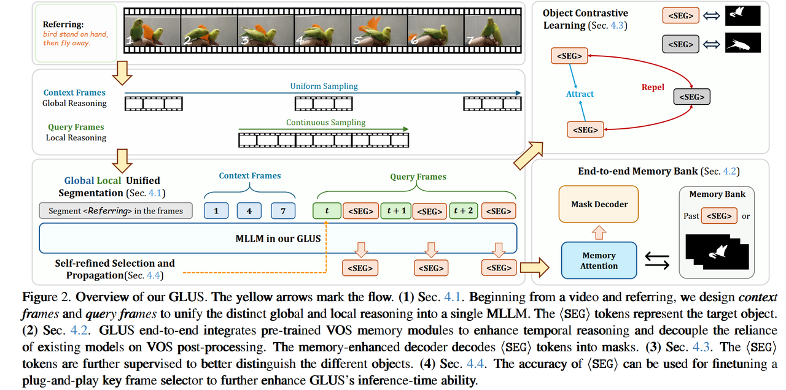
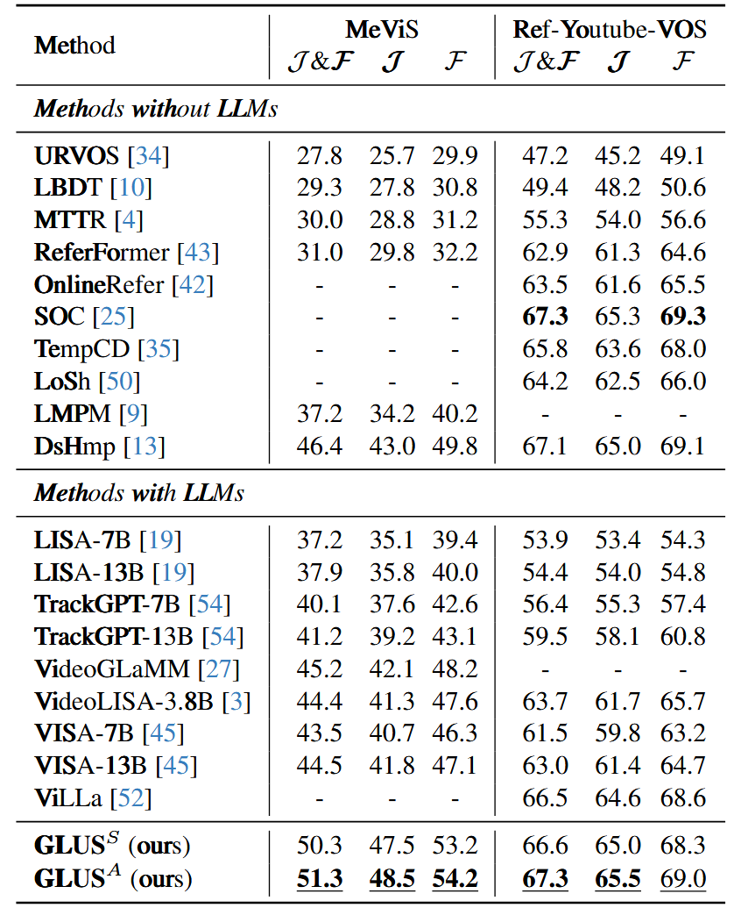

# 论文精读-GLUS

**论文链接：**

- arXiv: <https://arxiv.org/pdf/2411.17646>

## Motivation

"Ref"和"VOS"之间的trade-off，如何把寻找关键帧的global reasoning和追踪objects的local reasoning结合？

**核心思想：**

一个单独的MLLM要具备Global-Local unified reasoning for VOS的能力，不用VOS model。

**帧分类策略：**

把输入MLLM的frames分为两种：

1. **Context frames**: uniformly sampled from the whole video
2. **Query frames**: continuously sampled

把局部帧和全局帧都输入MLLM学习，用不同referring对比学习锁定正确对象。另外，可以用SAM2的memory module。

**背景回顾：**

先简单回顾一下LISA的practice：

$$<SEG> = MLLM(I, R), \quad M = DEC(I, <SEG>)$$

用到video里：

$$<SEG>_{1:N} = MLLM(I_{1:N}, R), \quad M_{1:N} = DEC(I_{1:N}, <SEG>_{1:N})$$

MLLM能处理的帧数N有限，因此很多现有的方法先采样关键帧然后用现成的VOS model propagate masks。

但是作者认为MLLM的自回归范式已经足以处理时序一致性，因而现成的VOS model是不需要的，local reasoning也可以交给MLLM完成。从而可以做到train reference consistent。

## Method

### Context and Local

把采样的context frames放在query frames的前面，作者认为这模仿了人类的行为，依次生成SEG token：

$$<SEG>_t = LLM ([R, I_{1:N_c}^{I_c}, I_1^Q, <SEG>_1, I_2^{Q}, <SEG>_{2}, \dots, I_t^{Q}])$$

**训练阶段：**

- 等间距采样 $N_C$
- 连续采样 $N_Q$
- 模仿LISA监督SEG token
- 模仿SAM2监督mask

**推理阶段：**

- 整个video平均分成 $N_C$ clips，取每个clip中间的帧作为context frames
- 用 $N_Q$ 长度，stride = 1的滑动窗口做groups of query frames

### Memory Bank for MLLMs

很简单的操作：

$$M_t = DEC(I_t^Q, <SEG>_t, membank)$$

### Object Contrastive Loss

为了增强类似物体之间的区分度用对比学习的方法。

注意到MeVis里面很多不同的expression很可能refer to the same object，这些指向相同物体的不同referring expressions所对应的SEG tokens就是positive examples。follow SimCLR采样negative examples以及计算loss。

但是问题在于positive examples比较少，只有MeVis中有multi-referring这样的情况。不过效果还是很好。

**扩展应用：**

此外，作者认为GLUS所展现的Global-local reasoning能力能够让他被用来做QA-based key frame selector的伪标签来训练。具体来说选取mask IOU最高的那些帧。还可以用这些关键帧做anchor，用VOS model propagate出mask。

## Results

## Conclusion

这篇文章主要创新点在于把local context的frames一起给MLLM，主要就是优化了LISA的采样方式，然后模仿SAM2用一个memory以及模仿SimCLR来一个对比学习，效果非常好。

**核心贡献：**

- 发现了之前的工作在采样上的缺陷
- 从人类标注数据集的流程（先global再localize）受到启发以此优化输入MLLM的samples
- 将global reasoning和local reasoning统一在一个MLLM框架中
