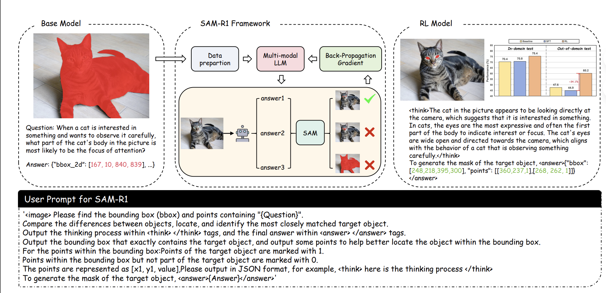
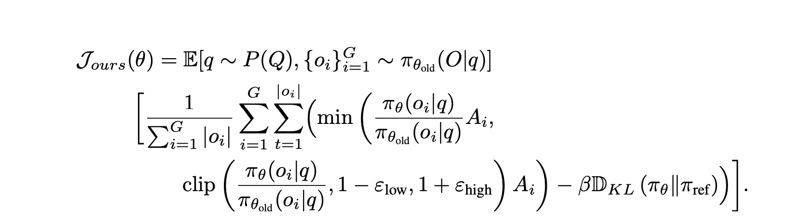
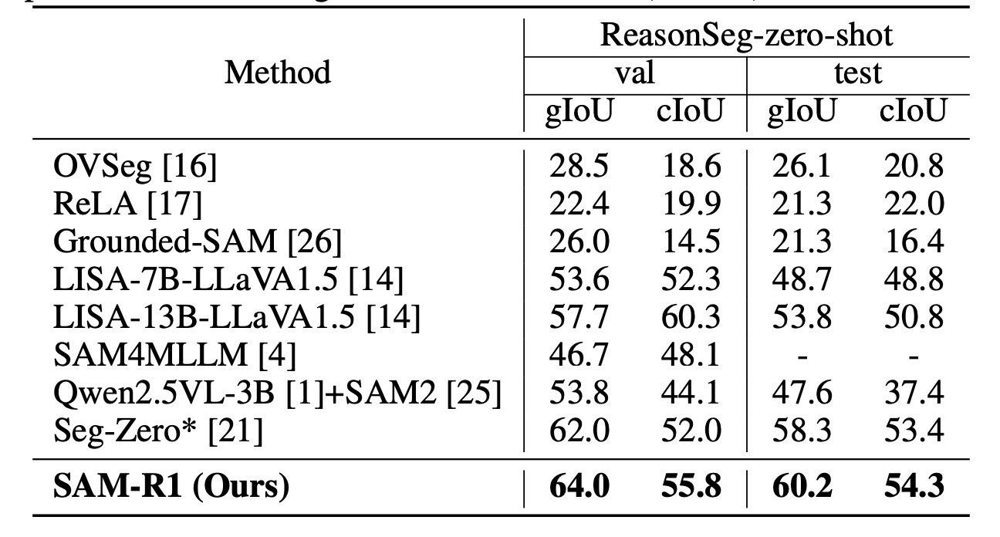

# 论文精读-SAM-R1

[https://arxiv.org/pdf/2505.22596](https://arxiv.org/pdf/2505.22596)

本文中作者尝试使用SAM作为reward feedback来进行multimodal segmentation model的训练

## Method

作者主要使用三个Reward functions，分别是IOU, Think Format Reward以及Output Format

算法上用GRPO避免了使用critic model，然后对GRPO的优化对象进行改进，即采用了R1范式，没有对每个output sequence长度取平均，而是对所有sequence长度和取平均(token-level loss normalization)，以及使用了high-low不同阈值asymmetric clipping

## Experiment

base model是Qwen2.5VL-7B，segmentation model是SAM2-Large，image size是840 $\times$ 840，每个query采样8 responses.

训练采用的数据集是refcocog 的3000 instances（应该指的是image - expression pairs?）然后在refcoco, refcoco plus以及ReasonSeg做evaluation，进一步评估模型out-of-distribution的能力

在ReasonSeg上超过Seg-Zero 平均2个点。

在三个refcoco的datasets上和Seg-Zero差不多

四个消融实验：

1. tiered threshold有效（应该指的是reward function）
2. GRPO的两个改进有效
3. KL constraint有效
4. Negative Reference Points没必要

## Conclusion

这篇工作用RL做image referring segmentation，主要贡献是证明GRPO改进的有效性，以及搭建了使用SAM 2 作为reward model的pipeline并且构建了对应的reward function
