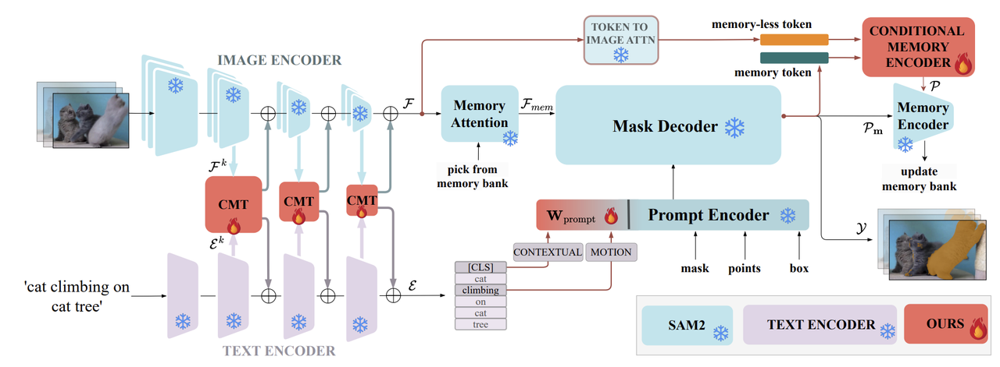
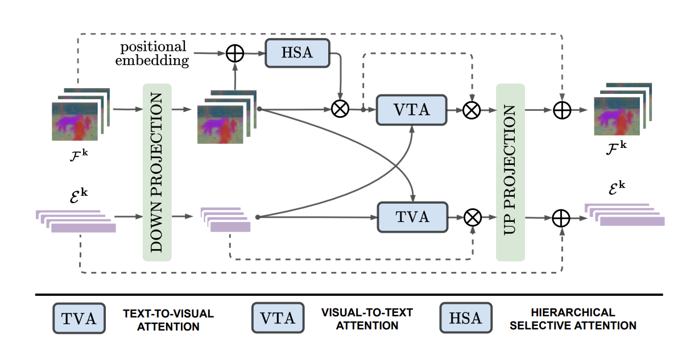
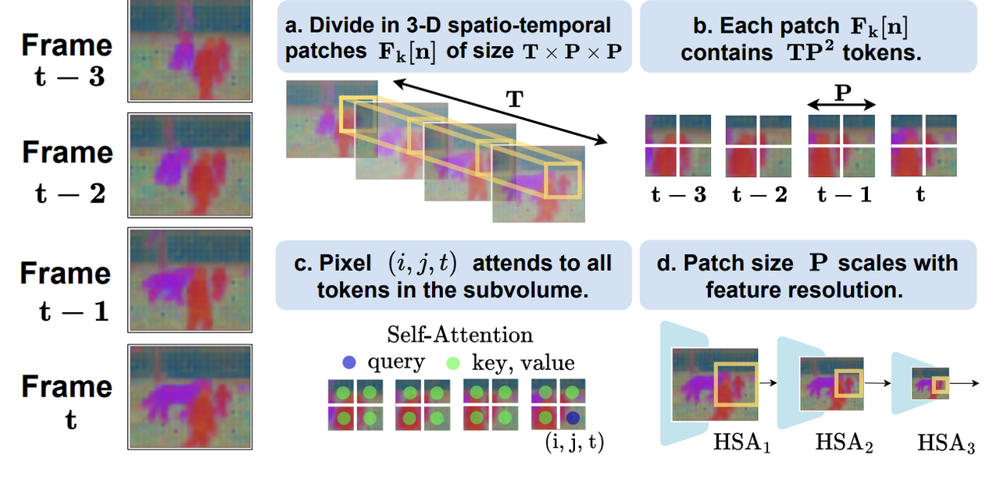
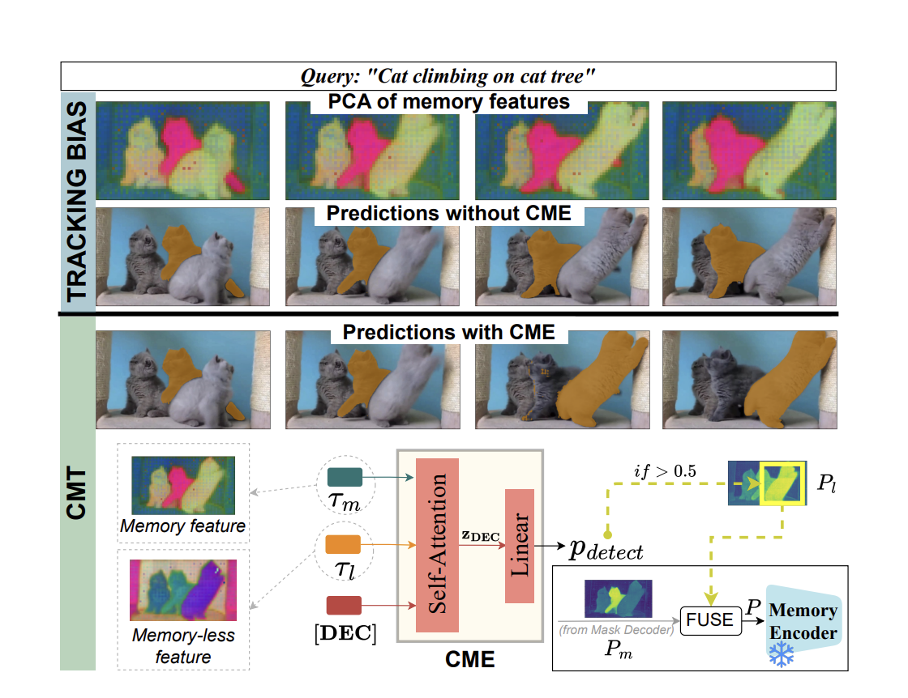
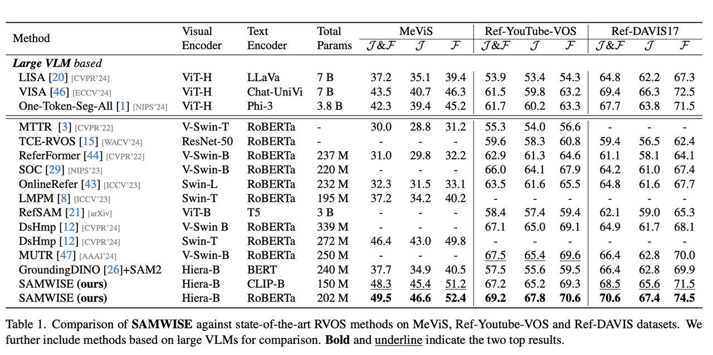

# SAMWISE

**论文链接：**

- GitHub: <https://github.com/ClaudiaCuttano/SAMWISE/tree/main>
- arXiv: <https://arxiv.org/pdf/2411.17646>

## Motivation

如何用SAM2做RVOS任务？面临三个主要挑战：

1. **Text understanding**: 如何用文本prompt SAM2？image任务上有BEIT-3、LLaVA，但是video上目前没有
2. **Temporal modeling**: 对应MeVis这种数据集对motion的要求
3. **Tracking bias**: 容易跟踪错，出现新的符合要求的object应该能迅速修正

**解决方案：**

- 最好引入参数比较小（不用finetune SAM2），然后不要用大的VLM
- 解决前两个问题：引入Cross-modal Temporal Adapter，并且用MLP成为Prompt Embedding给SAM2
- 解决第三个问题：用Conditional Memory Encoder，refocus its tracking

## Method

### Problem Setting

以streaming fashion process videos，每次处理T frames。把referring expression tokenize以后加一个[CLS]。

SAM2的encoder（Hiera）独立提取每一帧的特征，作者称为memory-less features，经过Memory Attention以后称为memory features。

### Prompt

用一个frozen的text encoder提取language features（一共L个tokens），选取其中属于[CLS] token以及verb token的，concat并用MLP投影成prompt给SAM2，每一帧都prompt。

### Cross-Modal Temporal Encoder

Adapter的经典框架：

$$\text{Adapter}(x) = x + \sigma(xW_{down})W_{up}$$

这里也是类似的但是cross-modal。

#### Hierarchical Selective Attention

直觉上motion是比较局部近端的，和邻近帧比较相关。

k是外部encoder的层次。先分成N个patch：

$$N = H_k W_k / P^2$$

每个patch有TP²个token，每个patch内加上positional embedding以后self attention：

$$x_{i, j, t}^{k, n} = x_{i, j, t}^{k, n} + e[i, j] + e[t]$$

$$x_{i, j, t}^{k, n} = SA\left(\left\{x_{i^{\prime}, j^{\prime}, t^{\prime}}^{k, n}\right\}\right)$$

i', j', t' 遍历P, P, T，注意这里P随着k scaled。

#### Cross-modal Adaptation

VTA 和 TVA两个cross attention模块：

$$F^k[t] = F^k[t] * CA(F^k[t], \mathcal{E}^k)$$

$$E^k = E^k * CA(E^k, F^k_{avg})$$

avg是在采样的clip中。

最后把MLP后的prompt encode以后和memory attention以后的visual features进mask decoder，得到mask token以及predicted mask。

### Conditional Memory Encoder

解决所谓的tracking bias。

作者发现memory-less的features有unbiased representation，可以用来规避past prediction的影响修正bias。

用SAM2 mask decoder的cross attention的参数先把memory之前的feature和encode之前的prompt $$\rho$$ 做一个CA得到memoryless token（对比sam2 decode出的mask token）。

加上一个learnable decision token分别做SA，得到新的decision token线性投影from d to 1得到 $p_{detect}$，大于0.5就有以下的修正机制：

$$P_l = D_{dec}(F, \rho)$$

$$M(h, w) = \mathbf{1}(h, w) \text{ where } P_l > 0$$

$$P = \lambda * P_l \circ M + P_m \circ (1 - M)$$

这里有特殊的训练方法。

## Results

**训练方式参考：**

Following [11, 21, 29, 43, 44], we undergo pre-training for 6 epochs on RefCOCO/+/g [31, 50] with a learning rate at 1e-4 and finetune on Ref-Youtube-VOS [39] for 4 epochs with a learning rate of 1e-5, using the Adam optimizer. The model trained on the Ref-YouTube-VOS is directly evaluated on DAVIS17 [18]. On MeViS [8], we train for 1 epoch. We set T = 8.

## Conclusion

作为RVOS的新SOTA，这篇工作修改SAM2增强了text understanding、temporal modeling，以及想办法修正memory导致的tracking bias以适应高难度的RVOS数据集比如MeVis。

主要贡献：

- 在强大的SAM2以及text encoder上做cross-modal adaptation
- 提供了一种方法来把现有的强大的模型用到别的任务的方法，具体来说就是想办法加模块做adaptation
- 如何把这种工作做的简单有效：一是参考之前的方法，二是从intuition出发（比如这里修正tracking bias）
  