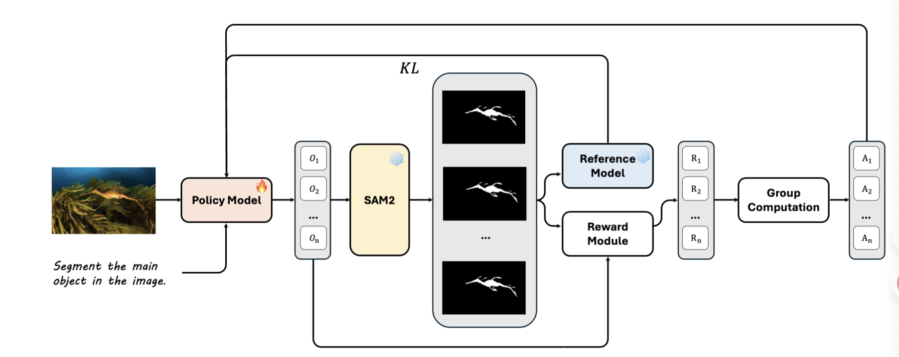
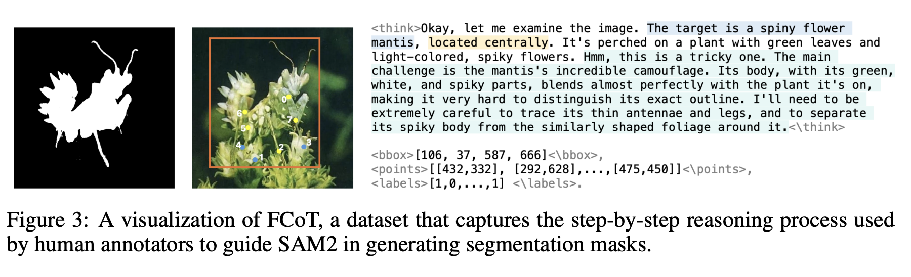
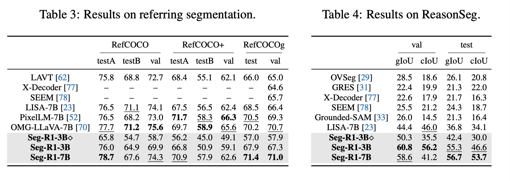

# 论文精读-Seg-R1

[https://arxiv.org/pdf/2506.22624](https://arxiv.org/pdf/2506.22624)
[https://geshang777.github.io/seg-r1.github.io/](https://geshang777.github.io/seg-r1.github.io/)

这篇文章也是用RL做segmentation，但是和[SAM-R1](论文精读-SAM-R1.md)存在一些区别

这篇工作做的任务是camouflaged object detection和salient object detection

另外这篇工作还提出了一个SFT的dataset FCoT

## Method

### RL

采用GRPO优化，但是输出tag还需要一个labels标签包裹所谓mask prompt

> We employ Qwen2.5-VL to predict points, bounding boxes, and labels (referred to as mask prompts) to guide SAM2  in mask generation. This approach reduces the dense prediction of segmentation to a sparse mask prompting task, significantly lowering the learning cost.

reward除了format reward和IoU作为部分的segmentation reward之外，还采用S-measure作为另外一部分的segmentation reward

### SFT

提出了一个数据集FCoT, 人类标注1500图片，记录标注时候的bbox points labels，然后用gemini加了reasoning process

## Experiments

先SFT再RL以及pure RL分别试验，在foreground segmentation 和 referring/reasoning segmentation上分别评估.这里放一下rs的结果

## Conclusion

本篇文章探索了RL在segmentation的作用，主要做foreground segmentation但是在referring segmentation上表现尚可。另外本文采用了SFT作为cold start能让模型先学会format之类。值得注意的是，本篇工作让大模型给sam2的prompt形式包括mask prompt，这一点使得SFT的作用大大增加.
