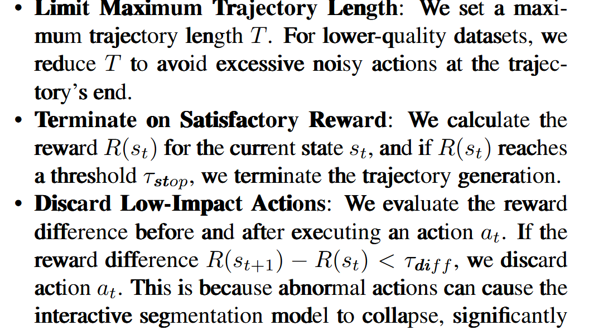

# SegAgent

**论文链接：**

- arXiv: <https://arxiv.org/abs/2503.08625>

## Formulation

定义一个MDP $\left(\textit{S}, \textit{A}, \textit{R}, \textit{T}, \gamma \right)$：

- **状态空间**: $s_t \in \textit{S}, s_t = \left(M_t, a_{0:t-1}\right)$，其中 $M_t$ 表示时间步 $t$ 的mask
- **动作空间**: $a_t = (\alpha_t, c_t) \in \textit{A}$，其中 $\alpha_t \in \{+1, -1\}$，$c_t \in [0, 1]^2$，表示在特定坐标的正/负点
- **转移函数**: $\textit{T} : \textit{S} \times \textit{A} \rightarrow \textit{S}$，映射为 $M_{t+1} = F_{iter}\left(I, s_t, a_t\right)$，其中 $s_{t+1} = (M_{t+1}, a_{0:t})$
- **奖励函数**: $\textit{R} : \textit{S} \rightarrow \mathbb{R}$，具体为 $R(s_t) = IoU(M_t, M_{target})$

**目标：** 训练一个策略 $\pi_{\theta} \left(a_t | s_t, \text{Image}, \text{Prompt}\right)$ 最大化最终步奖励期望 $R(s_T)$（最终mask质量），因此忽略 $\gamma$。

进一步地，在mask refinement这样的场景我们常常不知道之前的points，因此策略进一步简化成 $\pi_{\theta} \left(a_t | M_t, I, P\right)$。

## Data Generation

为了使用StaR优化算法，我们需要一系列标注的轨迹。

**现有数据：** referring segmentation数据集 $D_{seg} = \{(I, M_{target}, P) \}$

**目标数据：** 标注轨迹数据集 $D_{traj} = \{(I, M_{target}, P, [s_0, a_0, \cdots, s_T, a_T])\}$

算法如下，简单来说就是在FN和FP region的中间分别点positive point和negative point，这个函数称为 $F_{sim}$。

**三个原则：**

## Policy Improvement

这个算法和原来的StaR算法有两个区别（修改基于assuming $F_{sim}$ 相对较优）：

1. 原来的算法通过overall correctness filter轨迹，而这个算法在filter环节采取：保留增加reward的action，对于减少reward的action，换成 $F_{sim}$ 对应的action
2. 每次训练模型使用的数据是当前优化的数据和最初的数据的并，而非单纯是更新的数据

## Process Reward Model

Inference环节使用PRM，这个PRM就是大模型，在输出坐标之外，还让他输出当前的mIOU，每一步K个candidate action里面贪心选择最佳的，迭代T步。

## Experiments

作者认为RefCOCO系列质量不高（GT mask质量不高/expression简单/不要多步标注/场景简单），因此重新从已有数据集里收集了High-quality RES数据集，并证明这个HRES更适合这个setting。

**实验结果：**

- 在RefCOCO上提了1个点左右（对比SOTA）
- 在收集的HRES数据集上提升10+（只做了自身采用之前两个算法的消融实验）

**注意：** 采用了哪些数据生成轨迹等训练细节没有说。

## VideoSegAgent

如果要做video版本的：

### Pros

1. 以人标注的经验来看，标video时很难简单一次性搞定，优化算法有发挥的空间

### Cons

1. 这个image的SegAgent事实上可复现性是比较差的，最关键的data generation和train的细节很多遗漏

2. 难以将整个流程完全复制过来：

   - 引入时间维度，$F_{sim}$ 难以设计
   - MLLM窗口问题，MLLM spatial-temporal grounding的能力够不够输出(x, y, t)的坐标（这个可以优化，比如用frame tokens的last hidden states投影一个分布softmax到t，或者引入special tokens）

3. 这个做法很大的缺点是不可撤销，人类标注的经验来说，video上不让我撤销是比较难标的

### Ideas

1. 我们可以考虑采用别的强化学习算法规避 $F_{sim}$ 难以设计的问题（如何处理这个问题sparse reward（即只关心最后的mask）的特性？）

2. 根据人类标注的经验，我们或许可以先保证某张image最优，再考虑时间维度的two-stage做法

3. 推理时我们的PRM可以采用Describe Anything Model
